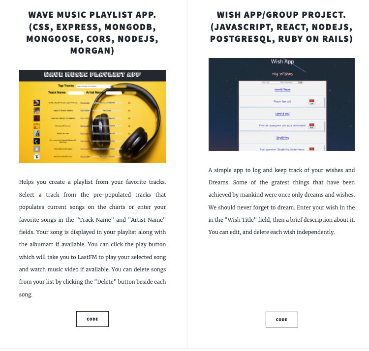

# PORTFOLIO WEBSITE.

## This was a website built to showcase my technical skills, web design skills.

### Project timeline and technologies used to Build a website in 24 hours to showcase the following:

My technical skill set,
My web design skill set,
My projects,
Technologies Used,
HTML5,
CSS3,
JavaScript (ES6),
AJAX,
MongoDB,
NodeJS,
Mongoose,
CORS,
Morgan,
React,
Postgesql,
Ruby on Rails,
Git and
GitHub.

### IMAGES 📷

